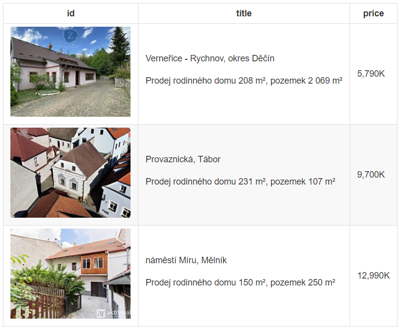

<!-- README.md is generated from README.Rmd. Please edit that file -->

```{r setup, include = FALSE}
knitr::opts_chunk$set(
  collapse = TRUE,
  comment = "#>"
)

file.remove("data/my_properties.rds")
```

# sreality

<!-- badges: start -->
<!-- badges: end -->

With the functions from this repository you can create your personal database of property offers from the Sreality website, update their status and analyse their history. You need some knowledge of R to do this.

## How to use

1. Clone this repo, or create a new project in RStudio and copy the R folder.
2. Create subfolders `data` and `images`.

### Load packages and functions

```{r message=FALSE, warning=FALSE}
library(tidyverse)
library(httr)
library(jsonlite)

source("R/sreality-funcs.R")
```

### Add property

Adds the property with the given URL to the `data/my_properties.rds` file. If you specify the `img_dir` parameter, a small preview image is downloaded and saved in this folder under the name _id_property.jpg_

If a property with the given id already exists in the file, an error will occur.

```{r}
add_property(
  data_path = "data/my_properties.rds",
  img_dir = "images/",
  url = "https://www.sreality.cz/detail/prodej/dum/rodinny/melnik-melnik-namesti-miru/3960968780"
)
```

Adds multiple properties to the `data/my_properties.rds` file. If any property id already exists in the file, an error will occur.

```{r}
add_property(
  data_path = "data/my_properties.rds",
  img_dir = "images/",
  url = c(
    "https://www.sreality.cz/detail/prodej/dum/rodinny/vernerice-rychnov-/2752723036",
    "https://www.sreality.cz/detail/prodej/dum/rodinny/tabor-tabor-provaznicka/3936430428"
  )
)
```

### Update properties

Fetches all properties in the `data/my_properties.rds` file from Sreality and appends their current data to the end of the file.

```{r}
update_properties(rds_path = "data/my_properties.rds")
```

### List archived data

#### Full content of the archive

```{r}
read_rds("data/my_properties.rds")
```

#### Current state of properties

Displays the current state of all properties in the `data/my_properties.rds` file.

```{r}
list_properies("data/my_properties.rds")
```

You can filter the previous dataframe by status (only valid: `status %in% c("init", "live")` or only removed: `status == "gone"`), by price change (`price_last != price_0`), etc.

#### List of properties using the {gt} package

```{r}
list_properies("data/my_properties.rds") |> 
  mutate(
    name = paste0("[", name, "](", url, ")"),
    name = map(name, gt::md)
  ) |> 
  select(name, location, price_last) |> 
  gt::gt() |> 
  gt::cols_label(price_last = "price") |> 
  gt::fmt_number(price_last, decimals = 0, suffixing = "K") |> 
  gt::as_raw_html()
```

You can also add images to the listing.

```{r eval=FALSE}
list_properies("data/my_properties.rds") |> 
  mutate(
    title = paste0(location, "\n\n", replace_na(name, "")),
    title = map(title, gt::md)
  ) |> 
  select(id, title, price_last) |>
  gt::gt() |> 
  gt::cols_label(price_last = "price") |> 
  gt::fmt_number(price_last, decimals = 0, suffixing = "K") |> 
  gt::text_transform(
    locations = gt::cells_body(columns = id),
    fn = function(x) {
      map_chr(x, function(x) {
        img_path <- here::here("images", paste0(x, ".jpg"))
        if (file.exists(img_path)) {
          gt::local_image(filename = img_path, height = 166)
        } else {
          x
        }
      })
    }
  )
```



```{r cleanup, include=FALSE}
file.remove("data/my_properties.rds")
```


## To-do

Maybe I'll add those features some day:

- Downloading preview images of the property.
- Shiny app to make it more user-friendly.
